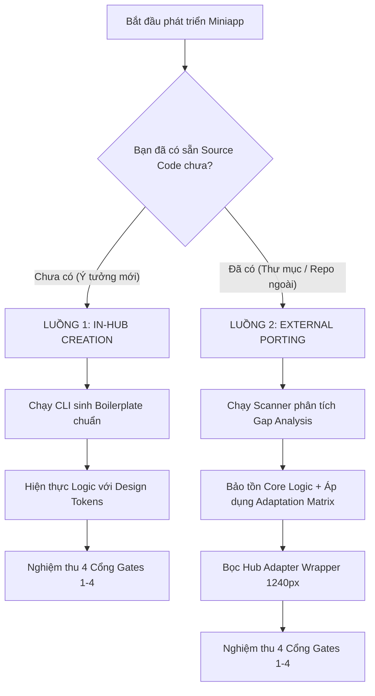

# 📘 CẨM NANG HƯỚNG DẪN PHÁT TRIỂN & TÍCH HỢP MINIAPP (MINIAPP DEVELOPER & PORTING GUIDE)
**AI-Tools Master Hub (`ai-tools`)**  
*Tài liệu thực hành từng bước dành cho Nhà phát triển & AI Agents khi khởi tạo miniapp mới hoặc chuyển đổi codebase bên ngoài vào Hub.*

---

## 🧭 MỤC LỤC
1. [Triết Lý & Nguyên Tắc Cốt Lõi](#1-triết-lý--nguyên-tắc-cốt-lõi)
2. [Nhận Diện Ngữ Cảnh: Tạo Mới Trong Hub vs Tích Hợp Bên Ngoài](#2-nhận-diện-ngữ-cảnh-tạo-mới-trong-hub-vs-tích-hợp-bên-ngoài)
3. [Luồng 1: Quy Trình Tạo Mới Trực Tiếp Trong Hub (In-Hub Creation)](#3-luồng-1-quy-trình-tạo-mới-trực-tiếp-trong-hub-in-hub-creation)
4. [Luồng 2: Quy Trình Tích Hợp Codebase Bên Ngoài (External Codebase Porting)](#4-luồng-2-quy-trình-tích-hợp-codebase-bên-ngoài-external-codebase-porting)
5. [Bảng Đối Chiếu Quy Tắc Chuyển Đổi (External-to-Hub Adaptation Matrix)](#5-bảng-đối-chiếu-quy-tắc-chuyển-đổi-external-to-hub-adaptation-matrix)
6. [Các Bẫy Kỹ Thuật Thường Gặp & Giải Pháp Phòng Vệ](#6-các-bẫy-kỹ-thuật-thường-gặp--giải-pháp-phòng-vệ)
7. [Checklist Nghiệm Thu Đưa Vào Vận Hành](#7-checklist-nghiệm-thu-đưa-vào-vận-hành)

---

## 📌 1. TRIẾT LÝ & NGUYÊN TẮC CỐT LÕI

AI-Tools Master Hub được xây dựng theo phong cách **Modern Utility Workspace** — không gian làm việc chuyên nghiệp, riêng tư và tốc độ cao. Mọi miniapp khi tham gia vào Hub phải tuân thủ 3 nguyên tắc:

1. **Sử Dụng Chung Tài Nguyên Nhưng Hoạt Động Hoàn Toàn Độc Lập**:
   - Sử dụng chung hệ thống Design Tokens, thư viện biểu tượng `lucide-react`, thanh điều hướng, cơ chế chuyển Theme Dark/Light và gói `@ai-tools/core`.
   - Nhưng **tuyệt đối không phụ thuộc trạng thái chéo**: lỗi sập của một miniapp bất kỳ không bao giờ được phép làm ảnh hưởng tới thanh điều hướng hay miniapp khác nhờ cơ chế cô lập `ToolErrorBoundary`.
2. **Xử Lý Riêng Tư Trên Trình Duyệt (Browser-First / Client-Side Focus)**:
   - Ưu tiên xử lý 100% dữ liệu (ảnh, video, PDF, bảng tính, âm thanh) trực tiếp trên trình duyệt của người dùng qua Web APIs, Web Workers, WASM. Không tự ý đẩy file lên máy chủ bên ngoài.
3. **Bảo Tồn Logic Nghiệp Vụ, Đồng Bộ Hóa Toàn Diện UI/UX**:
   - Khi đưa một codebase từ bên ngoài vào, **không được thay đổi thuật toán và logic nghiệp vụ** vốn có của công cụ.
   - Nhưng **bắt buộc phải tinh chỉnh và chuẩn hóa giao diện** để hòa nhập vào ngôn ngữ thiết kế chung: layout 1240px, Dark/Light mode token, Zero Horizontal Overflow, và không raw emoji.

---

## 🔍 2. NHẬN DIỆN NGỮ CẢNH: TẠO MỚI TRONG HUB VS TÍCH HỢP BÊN NGOÀI

Trước khi bắt đầu, hệ thống phân định rõ ràng 2 luồng công việc:



### Dấu hiệu nhận diện Codebase Bên Ngoài (External Indicators):
- Chứa file cấu hình riêng: `package.json`, `vite.config.js`, `tsconfig.json`.
- Sử dụng router trang độc lập: `react-router-dom` (`<BrowserRouter>`, `Routes`, `useNavigate`).
- Lạm dụng class sáng tĩnh: `bg-white`, `text-slate-900`, `border-gray-200`.
- Sử dụng thư viện icon ngoài hoặc raw emoji: `react-icons`, `@heroicons`, `FontAwesome`, hoặc icon emoji `🚀`, `📁`.
- Gọi API máy chủ backend riêng: `axios.post('http://...')`, `fetch('/api/...')`.
- Lưu trữ localStorage không đặt namespace: `localStorage.getItem('userData')`.

---

## 🚀 3. LUỒNG 1: QUY TRÌNH TẠO MỚI TRỰC TIẾP TRONG HUB (IN-HUB CREATION)

Dành cho nhà phát triển hoặc AI Agent xây dựng công cụ mới toanh từ đầu.

### Bước 1: Khởi tạo khung sườn tự động qua CLI
Chạy lệnh khởi tạo miniapp:
```bash
# Chế độ hỏi đáp thân thiện (Interactive Prompt):
npm run create:miniapp

# Hoặc chế độ truyền tham số trực tiếp (Dành cho AI Agent / CI):
npm run create:miniapp -- --id=audio-cutter --name="Cắt Ghép Âm Thanh" --cat=utils
```

**CLI sẽ tự động thực hiện 100% các thao tác nền tảng:**
1. Tạo thư mục wrapper: `hub/src/tools/<id>/<ToolName>Tool.jsx` (đã có Header, Breadcrumb, Privacy note, `ToolErrorBoundary`).
2. Tạo component nghiệp vụ: `packages/core/src/components/<ToolName>View.jsx` (đã có nhịp điệu 3 tầng, Dropzone dual-contract, i18n dictionary, và token CSS chuẩn).
3. Đăng ký metadata 3 ngôn ngữ vào: `hub/src/config/toolsRegistry.js`.
4. Nối dây dynamic import vào: `hub/src/App.jsx`.
5. Tạo file test mẫu tại: `hub/tests/tools/<id>.test.js`.
6. Tự động chạy rà soát Gate 1, 2, 3 để đảm bảo đạt chuẩn ngay lập tức.

### Bước 2: Hiện thực Core View Logic
Mở file `packages/core/src/components/<ToolName>View.jsx` để lập trình chức năng:
- Tham chiếu các mẫu component JSX có sẵn trong [docs/DESIGN_SYSTEM_REFERENCE.md](file:///Users/tranhaibang/.gemini/antigravity-ide/scratch/ai-tools/docs/DESIGN_SYSTEM_REFERENCE.md).
- Nhận prop `displayLang` để hiển thị nhãn tiếng Việt (`vi`), tiếng Anh (`en`), tiếng Nhật (`ja`).
- Tích hợp xử lý tệp tin với cơ chế dọn dẹp bộ nhớ: luôn gọi `URL.revokeObjectURL` khi xong việc.

### Bước 3: Rà soát & Kiểm thử chất lượng
```bash
# 1. Rà soát tĩnh (Gates 1, 2, 3):
node scripts/audit-miniapp.mjs <id>

# 2. Kiểm thử hợp đồng CI/CD:
npm test

# 3. Kiểm thử trình duyệt thực tế & Responsive đa thiết bị (Gate 4):
npm run test:browser:tool -- <id>
```

---

## 🔄 4. LUỒNG 2: QUY TRÌNH TÍCH HỢP CODEBASE BÊN NGOÀI (EXTERNAL CODEBASE PORTING)

Dành cho trường hợp bạn có sẵn một app React/Vite/Next.js độc lập và muốn đưa vào làm một miniapp trong AI-Tools Hub.

> [!IMPORTANT]
> **NGUYÊN TẮC BẤT DI BẤT DỊCH**:
> 1. **Bảo tồn nguyên vẹn 100% logic thuật toán nghiệp vụ** của codebase ngoài.
> 2. **Chỉ chuyển đổi lớp vỏ giao diện (UI/UX Layer)** để đồng bộ với Hub: dùng CSS Tokens, layout 1240px, icon `lucide-react`, và loại bỏ lỗi tràn ngang trên mobile.

### Bước 1: Chạy công cụ Phân Tích Khoảng Cách Tích Hợp (Porting Gap Analyzer)
```bash
npm run port:miniapp -- --source=/duong-dan/toi/codebase-ngoai --id=ten-cong-cu
```
Tập lệnh sẽ quét toàn bộ source code bên ngoài và xuất ra **Báo Cáo Khoảng Cách Tích Hợp (Porting Gap Analysis Report)**:
- Danh sách các file vi phạm class cấm: `bg-white`, `text-black`, `border-gray-200`.
- Danh sách nút bấm đang sử dụng raw emoji.
- Cảnh báo nếu codebase đang dùng `react-router-dom` gây xung đột URL hash.
- Cảnh báo các lệnh gọi API mạng máy chủ `fetch`/`axios`.
- Danh sách key `localStorage` chưa có namespace.

### Bước 2: Chuyển đổi mã nguồn theo Bảng Đối Chiếu Quy Tắc (Adaptation Matrix)
Dựa vào báo cáo Gap Analysis, tiến hành chuyển đổi lớp giao diện (xem chi tiết tại Mục 5):
1. **Dời Router**: Nếu app ngoài có nhiều trang con, chuyển thành **Tab nội bộ** hoặc **Step Wizard** (`useState('step1')`).
2. **Thay thế CSS Tokens**:
   - `bg-white` / `bg-slate-50` ➔ `bg-surface-container`
   - `text-slate-900` / `text-black` ➔ `text-on-surface`
   - `text-slate-500` / `text-gray-400` ➔ `text-on-surface-variant`
   - `border-slate-200` ➔ `border-border-subtle`
3. **Thay thế Icon**: Chuyển các raw emoji hoặc icon ngoài sang `lucide-react`.
4. **Namespace Storage**: Thay `localStorage.setItem('key')` bằng `localStorage.setItem('ai_tools_<id>_key')`.

### Bước 3: Đặt Component vào Kiến Trúc 2 Tầng của Hub
- Đặt component chính đã refactor UI vào: `packages/core/src/components/<ToolName>View.jsx`.
- Tạo file wrapper tương ứng: `hub/src/tools/<id>/<ToolName>Tool.jsx` bọc trong `max-w-[1240px]` và `ToolErrorBoundary`.
- Khai báo metadata trong `hub/src/config/toolsRegistry.js` và nối dây trong `hub/src/App.jsx`.

### Bước 4: Chạy nghiệm thu 4 cổng
Chạy `npm run audit:miniapps <id>` và `npm run test:browser:tool -- <id>` để xác nhận không còn lỗi rò rỉ hay tràn giao diện.

---

## 📊 5. BẢNG ĐỐI CHIẾU QUY TẮC CHUYỂN ĐỔI (EXTERNAL-TO-HUB ADAPTATION MATRIX)

| Thành Phần Kỹ Thuật | Codebase Bên Ngoài (Legacy / External) | Chuẩn Hóa Theo AI-Tools Hub (MAIS Standard) | Hướng Dẫn Kỹ Thuật Chi Tiết |
|:---|:---|:---|:---|
| **Khung Bao Ngoài (Root)** | Chiếm toàn bộ `window`, có Header/Navbar/Footer riêng | Bọc trong container chuẩn `max-w-[1240px] mx-auto px-4 sm:px-6 lg:px-8` | Xóa bỏ Header/Navbar/Footer riêng của app ngoài; sử dụng Context Header chuẩn của Hub |
| **Màu Nền & Bề Mặt** | Hardcode `bg-white`, `bg-gray-100`, `#f8fafc` | Semantic tokens: `bg-surface-container`, `bg-surface-canvas`, `bg-surface-subtle` | Đảm bảo hiển thị hoàn hảo ở cả Light và Dark Mode mà không cần viết điều kiện thủ công |
| **Màu Chữ & Viền** | Hardcode `text-black`, `text-slate-900`, `border-gray-300` | Semantic tokens: `text-on-surface`, `text-on-surface-variant`, `border-border-subtle` | Chống lỗi "tàng hình chữ" khi người dùng bật Dark Mode |
| **Cơ Chế Điều Hướng** | Dùng `react-router-dom` (`<BrowserRouter>`, `<Routes>`, `/page2`) | Single-Page công cụ: Dùng **Tab nội bộ** hoặc **Step Wizard** | Router hash của Hub là `#/tools/<id>`; app con không được can thiệp vào URL toàn trang |
| **Gọi Dịch Vụ Máy Chủ** | Gọi backend riêng: `fetch('http://localhost:5000/api')` | Xử lý **100% Client-Side** trên trình duyệt (hoặc Cloudflare Worker proxy) | Miniapp phải chạy offline được ngay tại browser; không lưu dữ liệu người dùng ra ngoài |
| **Hệ Thống Biểu Tượng** | Raw emoji (`🚀`, `⚙️`) hoặc thư viện ngoài (`react-icons`, FA) | **100% thư viện `lucide-react`** | Đồng bộ phong cách nét vẽ (stroke 2px), cấm hoàn toàn raw emoji trong các nút bấm |
| **Bộ Nhớ Trình Duyệt** | Lưu trực tiếp `localStorage.setItem('settings', ...)` | Thêm tiền tố định danh: `localStorage.setItem('ai_tools_<id>_settings', ...)` | Chống ghi đè và xung đột key với 11+ miniapp khác trong cùng domain |
| **Nạp Tệp (File Input)** | Thẻ `<input type="file">` mặc định, chỉ bấm click | **Dual-Contract Dropzone**: Kéo thả chuột + `<input type="file" className="hidden">` | Mang lại trải nghiệm hiện đại; cho phép các test runner headless nạp tệp tự động |
| **Đa Ngôn Ngữ (i18n)** | Hardcode tiếng Anh hoặc tiếng Việt trong JSX | Nhận prop `displayLang`, dùng từ điển i18n (`vi`, `en`, `ja`) | Phục vụ người dùng quốc tế, đảm bảo metadata khai báo đầy đủ 3 ngôn ngữ |
| **Quản Trị Sự Cố** | Khi gặp lỗi code không bắt được, trắng cả trang web | Bọc trong [ToolErrorBoundary](file:///Users/tranhaibang/.gemini/antigravity-ide/scratch/ai-tools/hub/src/components/ToolErrorBoundary.jsx) | Đảm bảo nút "Về Trung Tâm" luôn hoạt động an toàn, không sập toàn bộ Hub |

---

## ⚠️ 6. CÁC BẪY KỸ THUẬT THƯỜNG GẶP & GIẢI PHÁP PHÒNG VỆ

### 6.1. Bẫy Tràn Ngang Màn Hình Mobile (Horizontal Overflow Trap)
- **Triệu chứng**: Trang web bị rung lắc, xuất hiện thanh cuộn ngang khi xem trên iPhone (390px) hoặc Android (360px).
- **Nguyên nhân**:
  - Phần tử flex child chứa chuỗi văn bản dài mà thiếu thuộc tính `min-w-0`.
  - Bảng dữ liệu nhiều cột không được bọc trong container có class `overflow-x-auto`.
  - Sidebar hoặc phần tử con sử dụng vị trí `absolute` với `w-full` nhưng thẻ cha thiếu `relative`.
- **Giải pháp**:
  ```jsx
  /* ĐÚNG */
  <div className="flex-1 min-w-0">
    <p className="truncate">Chuỗi văn bản rất dài không bao giờ làm tràn trang</p>
  </div>
  
  <div className="overflow-x-auto w-full">
    <table>...</table>
  </div>
  ```

### 6.2. Bẫy Tự Động Phóng To Trên iOS Safari (Font-Zoom Trap)
- **Triệu chứng**: Khi người dùng chạm vào ô `<input>` hoặc `<select>` trên iPhone, màn hình Safari tự động zoom to lên 120%, làm vỡ layout làm việc.
- **Nguyên nhân**: Cỡ chữ trên thẻ input nhỏ hơn `16px` (`font-size < 16px`).
- **Giải pháp**: Mọi input bắt buộc dùng class `text-base sm:text-sm` (16px trên mobile, co về 14px trên desktop):
  ```jsx
  <input type="text" className="text-base sm:text-sm ..." />
  ```

### 6.3. Bẫy Kích Thước Vùng Bấm Quá Nhỏ (Touch Target Violation)
- **Triệu chứng**: Người dùng bấm nhầm nút hoặc bấm trượt trên điện thoại.
- **Giải pháp**: Chiều cao nút bấm chính, tab, vùng tải tệp tối thiểu phải đạt `44px` (`h-11`) hoặc `40px` (`h-10`):
  ```jsx
  <button className="h-11 sm:h-10 px-4 rounded-xl ...">Thực Hiện</button>
  ```

### 6.4. Bẫy Rò Rỉ Bộ Nhớ RAM (Memory Leak Trap)
- **Triệu chứng**: Trình duyệt ngốn hàng GB RAM khi xử lý nhiều file ảnh/PDF liên tiếp.
- **Nguyên nhân**: Gọi `URL.createObjectURL(blob)` mà quên gọi `URL.revokeObjectURL(url)`.
- **Giải pháp**: Bắt buộc giải phóng URL trong hàm dọn dẹp của `useEffect` hoặc ngay sau khi tệp tải về thành công.

---

## ✅ 7. CHECKLIST NGHIỆM THU ĐƯA VÀO VẬN HÀNH

Trước khi commit và đưa miniapp mới vào production, hãy đảm bảo vượt qua bảng kiểm tra:

- [ ] **Khung chứa:** Miniapp nằm gọn trong `max-w-[1240px] mx-auto px-4 sm:px-6 lg:px-8`.
- [ ] **Màu sắc:** 0 class `bg-white`, 0 class `text-black`, 100% dùng CSS semantic tokens.
- [ ] **Biểu tượng:** 0 raw emoji trong các nút bấm, 100% dùng icon từ `lucide-react`.
- [ ] **Đa ngôn ngữ:** Nhận prop `displayLang`, khai báo đủ 3 thứ tiếng trong `toolsRegistry.js`.
- [ ] **Dropzone:** Có hỗ trợ kéo thả chuột và chứa thẻ `<input type="file" className="hidden">`.
- [ ] **Mobile Responsive:** Đạt tiêu chuẩn Zero Horizontal Overflow trên iPhone (390px) và Android (360px).
- [ ] **Cô lập lỗi:** Được bọc trong `ToolErrorBoundary`.
- [ ] **Rà soát tĩnh:** Lệnh `npm run audit:miniapps <id>` đạt kết quả `PASS`.
- [ ] **Kiểm thử trình duyệt:** Lệnh `npm run test:browser:tool -- <id>` đạt 100% PASS và 0 lỗi console.
