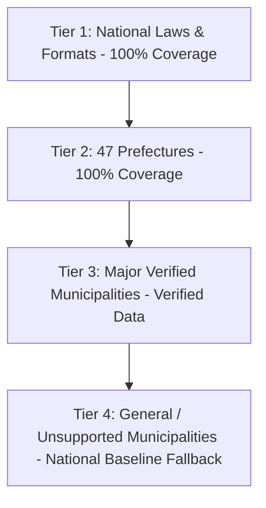

# Japan Life V1: Locality & Municipality Coverage Matrix

- **Date**: 2026-09-11
- **Scope**: National, 47 Prefectures, and Municipal Tiers
- **Fallback Philosophy**: Graceful Degradation (Unsupported Locality -> National Standard Baseline -> Clear Disclaimer)

---

## 1. Locality Tier Hierarchy

### Tier 1 — National Jurisdiction (100% Covered)
- **Income Tax**: NTA National Tax Law, 7 tax brackets, nationwide standard deductions.
- **National Pension**: Japan Pension Service (JPS), national monthly contribution (16,980 JPY for FY2024-2026).
- **Employment Insurance**: MHLW statutory rates, nationwide Hello Work unemployment criteria.
- **Immigration / Visas**: Immigration Services Agency (ISA), nationwide statutory procedures, fees, and documentation.
- **Administrative Documents**: Standard formats for Juminhyo, Koseki, Tax slips, My Number.

### Tier 2 — 47 Prefectures (100% Covered in JIS X 0401 Order)
- **Resident Tax (Jūminzei)**:
  - Standard 10% income levy (4% prefectural + 6% municipal) across all 47 prefectures.
  - Special prefectural environmental surcharges modeled (e.g., Osaka Shinrin Kankyozei 300 JPY, Kanagawa Suigenzei).
  - Defined in `packages/core/src/utils/tax/rules/locations/prefectureDefaults.js`.
- **Health Insurance (Kyōkai Kenpō)**:
  - Exact branch rates for all 47 prefectures for FY2025 and FY2026 (e.g., Tokyo 9.98%, Osaka 10.34%, Fukuoka 10.27%, Saga 10.51%).
  - Defined in `packages/core/src/japan/insurance/rules/kyokaiKenpoRates.js`.

### Tier 3 — Major Verified Municipalities (Deep Operational Coverage)
Directly verified municipal data for counter locations, convenience store kiosk discounts, and local subsidies:

| JIS Code | Municipality Name | Prefecture | Konbini Kiosk Service | Juminhyo Fee (Counter / Konbini) | Special Local Features |
| :--- | :--- | :--- | :--- | :--- | :--- |
| `131016` | Chiyoda-ku | Tokyo | Available | 300 JPY / 200 JPY | Special infant/child birth voucher |
| `131032` | Minato-ku | Tokyo | Available | 300 JPY / 200 JPY | Multi-language English counter, birth gift grant |
| `131041` | Shinjuku-ku | Tokyo | Available | 300 JPY / 200 JPY | High foreign resident density assistance |
| `131122` | Setagaya-ku | Tokyo | Available | 300 JPY / 200 JPY | Digital appointment reservation system |
| `131131` | Shibuya-ku | Tokyo | Available | 300 JPY / 200 JPY | Smart city digital linepass integration |
| `141003` | Yokohama-shi | Kanagawa | Available | 300 JPY / 250 JPY | Administrative service corners at major stations |
| `231002` | Nagoya-shi | Aichi | Available | 300 JPY / 150 JPY | Konbini 150 JPY discount initiative |
| `271004` | Osaka-shi | Osaka | Available | 300 JPY / 200 JPY | Ward office kiosk kiosks |
| `401307` | Fukuoka-shi | Fukuoka | Available | 300 JPY / 150 JPY | Smart city subsidized child healthcare portal |

### Tier 4 — General / Unsupported Municipalities (Safe Fallback Engine)
For any of the remaining ~1,700 municipalities in Japan:
1. **No Application Crash**: The system never errors on unknown or unverified municipality codes.
2. **National Standard Baseline**:
   - Counter fee defaults safely to national modal: 300 JPY.
   - Convenience store issuance note: *"Convenience store printing requires local municipal participation in the J-LIS network. Please check your local city hall's official website."*
   - Status badge displays: `Unverified Municipality - National Standard Estimate`.
   - Never states "Feature not available" when it is merely "Not verified by Toolio".
