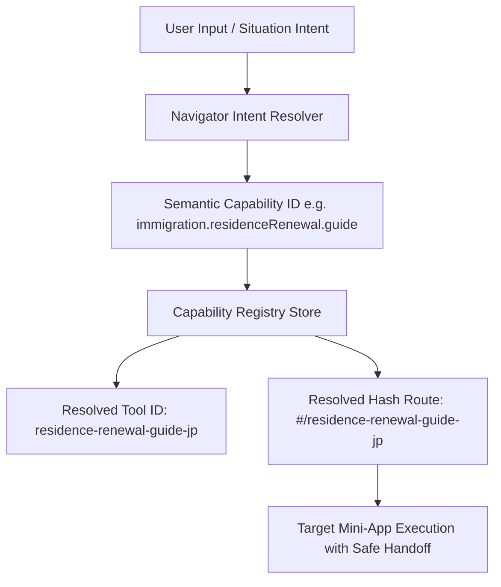

# JAPAN LIFE CAPABILITY AUDIT (PHASE 9)
**Package**: `@ai-tools/core` & `hub`  
**Date**: 2026-09-11  
**Status**: COMPLETE INVENTORY & GAP ANALYSIS

---

## 1. Executive Summary
Phase 9 transitions Toolio from domain-isolated mini-apps into a cohesive, orchestrated Japan Life platform.
A fundamental architectural tenet is:
> **Semantic Capabilities are the Single Source of Routing Truth.**  
> User intents and Life Event runtimes NEVER target hardcoded tool paths or routes.  
> They resolve abstract capabilities via the `CapabilityRegistry`, which securely resolves to underlying miniapps.

This document inventories all 33 active Japan Life capabilities, their input/output contracts, regulatory grounding, and identifies capability gaps for future phases.

---

## 2. Capability Inventory Matrix

| Capability ID | Tool ID | Domain | Country | Type | User Intent | Regulatory | Life Event Compatible | Accepted Context Fields | Produced Context Fields |
|---|---|---|---|---|---|---|---|---|---|
| `employment.overtime.calculate` | `overtime-calculator-jp` | employment | JP | calculator | Tính tiền làm thêm giờ (36協定) | YES | YES | `salary`, `baseSalary`, `scheduledHours`, `overtimeHours`, `isLateNight`, `isHoliday` | `overtimePay`, `statutoryLimitExceeded` |
| `employment.paidLeave.check` | `paid-leave-checker-jp` | employment | JP | checker | Kiểm tra số ngày phép năm luật định | YES | YES | `hireDate`, `workingDaysPerWeek`, `attendanceRate` | `grantedLeaveDays`, `mandatoryUsageDays` |
| `employment.unemployment.eligibility` | `unemployment-eligibility-jp` | employment | JP | checker | Đủ điều kiện nhận trợ cấp thất nghiệp không? | YES | YES | `insuredMonths`, `resignationReason`, `isCompanyBankruptcy` | `isEligible`, `recipientCategory`, `waitingPeriodDays` |
| `employment.unemployment.benefit` | `unemployment-benefit-jp` | employment | JP | calculator | Nhận được bao nhiêu tiền trợ cấp thất nghiệp? | YES | YES | `age`, `insuredMonths`, `preResignationSalary6Months`, `resignationReason` | `dailyBenefitAmount`, `totalBenefitDays`, `totalBenefitAmount` |
| `employment.leavingJob.guide` | `leaving-job-wizard-jp` | employment | JP | wizard | Lộ trình và checklist khi nghỉ việc | YES | YES | `resignationDate`, `hasNewJob`, `separationNoticeReceived` | `completedTasks`, `nextDeadlines` |
| `insurance.socialInsurance.calculate` | `social-insurance-jp` | insurance | JP | calculator | Ước tính tiền đóng Shakai Hoken hàng tháng | YES | YES | `monthlySalary`, `bonus`, `age`, `prefecture`, `hasCareInsurance` | `healthInsuranceEmployee`, `welfarePensionEmployee`, `employmentInsuranceEmployee` |
| `insurance.socialInsurance.eligibility` | `social-insurance-eligibility-jp` | insurance | JP | checker | Bắt buộc tham gia Shakai Hoken hay Kokumin? | YES | YES | `employmentType`, `weeklyHours`, `monthlyWage`, `companySize` | `mandatoryEnrollment`, `enrollmentScheme` |
| `insurance.pension.national` | `national-pension-jp` | pension | JP | simulator | Miễn giảm lương hưu quốc dân & hoàn thuế Nenkin | YES | YES | `residentStatus`, `incomeLevel`, `studentStatus`, `isDepartureFromJapan` | `exemptionType`, `lumpSumWithdrawalEstimate` |
| `insurance.health.dependent` | `dependent-insurance-jp` | insurance | JP | checker | Đưa người thân vào diện phụ thuộc bảo hiểm (扶養) | YES | YES | `dependentRelation`, `dependentAge`, `dependentAnnualIncome`, `cohabitation` | `isDependentApproved`, `barrierThresholds` |
| `family.maternity.allowance` | `maternity-allowance-jp` | family | JP | calculator | Tiền thai sản & nghỉ sinh (出産育児一時金 / 出産手当金) | YES | YES | `expectedDeliveryDate`, `actualDeliveryDate`, `standardMonthlyRemuneration` | `childbirthLumpSum`, `maternityAllowanceTotal` |
| `family.childcare.eligibility` | `childcare-leave-eligibility-jp` | family | JP | checker | Điều kiện nghỉ chăm con (育児休業) | YES | YES | `employmentType`, `employedDurationMonths`, `childAgeMonths` | `isLeaveEligible`, `maxLeaveDuration` |
| `family.childcare.benefit` | `childcare-benefit-jp` | family | JP | calculator | Trợ cấp nghỉ chăm con (育児休業給付金) | YES | YES | `wageBeforeLeave`, `leaveMonths`, `bothParentsTakingLeave` | `benefitInitial6Months`, `benefitSubsequentMonths` |
| `family.childAllowance.calculate` | `child-allowance-jp` | family | JP | calculator | Trợ cấp trẻ em hàng tháng (児童手当 2024 reform) | YES | YES | `childrenAges`, `childOrder`, `householdIncome` | `monthlyAllowance`, `annualTotal` |
| `family.birth.guide` | `birth-wizard-jp` | family | JP | wizard | Lộ trình và thủ tục trước & sau khi sinh con | YES | YES | `expectedDeliveryDate`, `municipality`, `employmentStatus` | `birthChecklist`, `statutoryDeadlines` |
| `tax.japan.calculate` | `japan-tax-simulator` | tax | JP | simulator | Ước tính thuế thu nhập, thuế thị dân, khấu trừ | YES | YES | `annualGrossSalary`, `businessRevenue`, `prefecture`, `dependentsCount` | `incomeTax`, `residentTax`, `takeHomeNet` |
| `housing.moving.cost.calculate` | `moving-cost-jp` | housing | JP | calculator | Dự toán chi phí chuyển nhà và thuê phòng | NO | YES | `roomLayout`, `distanceKm`, `moveSeason`, `initialDepositMonths` | `estimatedMovingFee`, `initialContractCost` |
| `housing.moving.admin.check` | `moving-admin-checker-jp` | housing | JP | checker | Phân loại thủ tục chuyển nhà (cùng quận vs khác tỉnh) | YES | YES | `oldMunicipality`, `newMunicipality`, `moveDate` | `transferType`, `requiresTenshutsu`, `requiresTennyu` |
| `housing.address.change.check` | `address-change-checklist-jp` | housing | JP | checklist | Danh mục cập nhật địa chỉ (hành chính & tiện ích) | YES | YES | `hasMyNumberCard`, `hasVehicle`, `hasPet`, `bankAccounts` | `checklistTasks`, `taskDeadlines` |
| `housing.moving.guide` | `moving-wizard-jp` | housing | JP | wizard | Lộ trình chuyển nhà toàn diện | YES | YES | `moveDate`, `oldMuni`, `newMuni`, `hasChildren` | `movingTimeline`, `completedTasks` |
| `immigration.workScope.check` | `work-scope-checker-jp` | immigration | JP | checker | Visa hiện tại có được làm công việc này không? | YES | YES | `residenceStatus`, `jobCategory`, `degreeField`, `weeklyHours` | `isScopeAllowed`, `requiresPermission` |
| `immigration.residenceRenewal.guide` | `residence-renewal-guide-jp` | immigration | JP | guide | Hướng dẫn gia hạn visa lao động / gia đình | YES | YES | `residenceStatus`, `expirationDate`, `employerCategory` | `renewalWindow`, `requiredDocsCategory` |
| `immigration.affiliationChange.check` | `affiliation-change-checker-jp` | immigration | JP | checker | Khai báo thay đổi cơ quan trực thuộc (trong 14 ngày) | YES | YES | `residenceStatus`, `eventDate`, `changeType` | `requiresNotification`, `notificationDeadline`, `isOnlinePermitted` |
| `immigration.statusChange.guide` | `status-change-guide-jp` | immigration | JP | guide | Đổi tư cách lưu trú (du học sang đi làm, kết hôn) | YES | YES | `currentStatus`, `targetStatus`, `degreeLevel`, `sponsorRelation` | `eligibilityScore`, `requiredDocumentSet` |
| `immigration.familyImmigration.guide` | `family-immigration-guide-jp` | immigration | JP | guide | Bảo lãnh vợ/chồng/con sang Nhật (COE / Kaizoku Taizai) | YES | YES | `sponsorStatus`, `sponsorAnnualIncome`, `relationType` | `financialSufficiency`, `coeDocumentList` |
| `immigration.permanentResidence.check` | `pr-readiness-checker-jp` | immigration | JP | checker | Đánh giá điều kiện nộp đơn Vĩnh trú (Eijyu) | YES | YES | `residenceDurationYears`, `annualIncomePast5Years`, `pensionLatePayments` | `readinessScore`, `disqualifyingFlags` |
| `immigration.arrivingInJapan.guide` | `arriving-in-japan-wizard-jp` | immigration | JP | wizard | Lộ trình nhập cảnh & thiết lập cuộc sống ban đầu | YES | YES | `arrivalDate`, `residenceStatus`, `landingAirport`, `hasWork` | `arrivalChecklist`, `municipalRegistrationDeadline` |
| `immigration.leavingJapan.guide` | `leaving-japan-wizard-jp` | immigration | JP | wizard | Lộ trình rời Nhật Bản vĩnh viễn hoặc tạm thời | YES | YES | `departureDate`, `isPermanentExit`, `pensionWithdrawalIntent` | `exitChecklist`, `tenshutsuDeadline`, `lumpSumNenkinWindow` |
| `documents.finder` | `document-finder-jp` | documents | JP | finder | Tra cứu danh mục giấy tờ cần nộp theo thủ tục | YES | YES | `procedureId`, `intentId`, `searchQuery` | `mandatoryDocs`, `conditionalDocs`, `statutoryDeadline` |
| `documents.certificate.guide` | `certificate-acquisition-guide-jp` | documents | JP | guide | Hướng dẫn xin giấy tờ ở Combini, Quầy, Online, Bưu điện | YES | YES | `documentId`, `municipalityCode`, `hasMyNumberCard` | `availableChannels`, `fees`, `domicileRegistrationRequired` |
| `documents.mynumber.guide` | `mynumber-procedure-guide-jp` | documents | JP | guide | Xử lý sự cố thẻ My Number (mất thẻ, khóa PIN, đổi địa chỉ) | YES | YES | `scenarioId`, `certificateType` | `actionProtocol`, `hotlineInfo`, `counterRequired` |
| `documents.form.helper` | `official-form-helper-jp` | documents | JP | helper | Giải thích từng ô và chuẩn bị nháp đơn hành chính PDF | YES | YES | `formId`, `userDraftValues` | `fieldMeanings`, `cleanDraftJson`, `privacyGuaranteed` |
| `documents.requirement.check` | `procedure-requirement-checker-jp` | documents | JP | checker | Tự đánh giá hồ sơ 3 chiều (hạn nộp, độ tươi 3 tháng, lệ phí) | YES | YES | `procedureId`, `documentDates`, `submissionMethod` | `readinessLevel`, `freshnessIssues`, `feePrepared` |
| `documents.admin.navigate` | `administrative-navigator-jp` | documents | JP | navigator | Điều hướng tra cứu liên kết giữa thủ tục và giấy tờ | YES | YES | `searchQuery` | `matchedDocs`, `matchedProcedures`, `disambiguationCard` |

---

## 3. Capability Gap Analysis

| Life Situation / Need | Status | Existing Equivalent or Mitigation | Recommendation for Future |
|---|---|---|---|
| **Driver's License Conversion (Gaimen Kirikae)** | `guide-only` | Hiện chỉ đề cập trong Checklist của `arriving-in-japan-wizard-jp`. Chưa có tool tính thời gian lái xe 3 tháng ở nước ngoài. | Phase 10 candidate (`transport.license.conversion`) |
| **Divorce / Separation Administration** | `partially-covered` | Giấy tờ ly hôn nằm trong `koseki_tohon` của Phase 8; phân chia thuế/phụ thuộc nằm trong `japan-tax-simulator`. Chưa có dedicated flow. | V2 candidate (`family.divorce.guide`) |
| **Business Manager Visa & Company Incorporation** | `intentionally-out-of-scope` | Toolio tập trung vào cá nhân người lao động / gia đình; thủ tục thành lập công ty (Hojin Setsuritsu) đòi hỏi tư vấn Shihoshoshi / Gyoseishoshi. | Giữ out-of-scope |
| **Inheritance & Gift Tax (Souzoku / Zouyo)** | `intentionally-out-of-scope` | Vượt ngoài phạm vi thuế thu nhập cá nhân cơ bản; quy tắc phức tạp. | Giữ out-of-scope |
| **Long-term Care Insurance (Kaigo Hoken) Application** | `partially-covered` | Khấu trừ bảo hiểm đã tính trong `social-insurance-jp`. Thủ tục xin chứng nhận cần chăm sóc (要介護認定) chưa có wizard. | Phase 10 / V2 candidate |
| **Bank Account Freezing upon Departure** | `covered` | Đã có trong checklist `leaving-japan-wizard-jp` (Bán/chuyển khoản, đóng tài khoản trước khi về nước). | Fully covered |

---

## 4. Capability Resolution Flow

- **Zero Hardcoding**: Navigator chỉ tương tác với Canonical Capability IDs.
- **Fail-Safe Fallback**: Nếu capability chưa được kích hoạt, registry trả về `isAvailable: false` với thông báo hỗ trợ thay vì làm ứng dụng bị crash.
