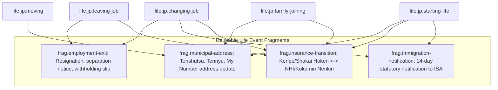

# JAPAN LIFE EVENT COVERAGE & TAXONOMY STANDARDIZATION (PHASE 9)
**Package**: `@ai-tools/core`  
**Date**: 2026-09-11  
**Status**: AUDIT COMPLETE & TAXONOMY STANDARDIZED

---

## 1. Audit of Existing Life Events

We performed a deep codebase audit across all existing life event definitions to verify compliance with:
- `LifeEventRuntime`
- `CapabilityRegistry`
- `DocumentFoundation` (Phase 8)
- `RegulatorySources` & `JurisdictionModel` (Phase 2)

| Event Name | File Path | Existing ID | Canonical ID | Runtime Engine | Capability Reg Compliant? | Regulatory Citations? | Status |
|---|---|---|---|---|---|---|---|
| **Leaving Job** | `packages/core/src/japan/employment/rules/leavingJobDefinition.js` | `leaving-job` | `life.jp.leaving-job` | `LifeEventRuntime` | YES (`employment.unemployment.*`, `insurance.pension.*`) | YES (Employment Insurance Act, Labor Standards Act) | **VERIFIED** |
| **Pregnancy & Childbirth** | `packages/core/src/japan/family/rules/birthDefinition.js` | `birth` | `life.jp.pregnancy-birth` | `LifeEventRuntime` | YES (`family.maternity.*`, `family.childAllowance.*`) | YES (Child Allowance Act, Health Insurance Act) | **VERIFIED** |
| **Housing Relocation** | `packages/core/src/japan/housing/rules/movingWizardDefinition.js` | `moving` | `life.jp.moving` | `LifeEventRuntime` | YES (`housing.moving.*`, `housing.address.*`) | YES (Basic Resident Registration Act) | **VERIFIED** |
| **Arriving in Japan** | `packages/core/src/japan/immigration/arrival/arrivalDefinition.js` | `arriving-in-japan` | `life.jp.starting-life` | `LifeEventRuntime` | YES (`immigration.workScope.*`, `insurance.socialInsurance.*`) | YES (Immigration Control Act, My Number Act) | **UNIFIED/ENRICHED** |
| **Leaving Japan** | `packages/core/src/japan/immigration/departure/departureDefinition.js` | `leaving-japan` | `life.jp.leaving-japan` | `LifeEventRuntime` | YES (`insurance.pension.national`, `immigration.*`) | YES (National Pension Act lump-sum withdrawal) | **VERIFIED** |

---

## 2. Canonical Life Event Taxonomy

Toolio standardizes on structured, hierarchical, non-translated canonical identifiers:

```
life.jp.<event_slug>
```

| Canonical ID | Display Name (JA / VI / EN) | Core Purpose | Orchestrated Domains |
|---|---|---|---|
| `life.jp.starting-life` | 日本生活スタート / Bắt đầu cuộc sống tại Nhật / Starting Life in Japan | Đón người mới sang, đăng ký địa chỉ, My Number, thẻ ngân hàng, SIM, bảo hiểm, trường học/công ty, thuế ban đầu. | Immigration, Housing, Insurance, Pension, Employment, Tax, Documents |
| `life.jp.changing-job` | 転職・会社変更 / Chuyển việc tại Nhật / Changing Jobs in Japan | Quản lý toàn bộ tiến trình từ khi xin nghỉ việc ở công ty cũ, xử lý gap nghỉ gián đoạn, thông báo Cục Xuất Nhập Cảnh, bảo hiểm & lương hưu, thuế và bắt đầu công ty mới. | Employment, Immigration, Insurance, Pension, Tax, Documents |
| `life.jp.leaving-job` | 退職・離職手続き / Nghỉ việc & Thủ tục thất nghiệp / Leaving a Job | Tập trung vào thủ tục nghỉ việc, nhận trợ cấp thất nghiệp Hello Work, nhận giấy tờ rời công ty. | Employment, Insurance, Pension, Tax |
| `life.jp.pregnancy-birth` | 妊娠・出産・育児 / Mang thai & Sinh con / Pregnancy & Childbirth | Toàn bộ quyền lợi thai sản, trợ cấp sinh con 500.000 JPY, nghỉ chăm con, thủ tục khai sinh và trợ cấp trẻ em. | Family, Insurance, Employment, Documents |
| `life.jp.moving` | 引越し・転居 / Chuyển nhà / Moving & Relocation | Thủ tục chuyển đi (Tenshutsu), chuyển đến (Tennyu), cập nhật thẻ My Number, cập nhật địa chỉ bảo hiểm, điện nước internet. | Housing, Documents, Insurance, Family |
| `life.jp.family-joining` | 家族呼び寄せ・同居開始 / Bảo lãnh gia đình sang Nhật / Family Joining in Japan | Tiến trình bảo lãnh vợ/chồng/con từ xin COE, nhập cảnh, đăng ký cư trú, thêm vào bảo hiểm phụ thuộc (Fuyou), thủ tục giáo dục. | Immigration, Insurance, Family, Tax, Documents |
| `life.jp.leaving-japan` | 帰国・出国手続き / Rời Nhật Bản / Leaving Japan | Chuyển địa chỉ ra nước ngoài, đóng thẻ cư trú, hoàn thuế Nenkin 1 lần, thanh lý hợp đồng dịch vụ, ủy quyền thuế. | Immigration, Pension, Tax, Housing, Documents |

---

## 3. Analysis: Starting Life vs Arriving in Japan

In Phase 7, `arriving-in-japan-wizard-jp` was built focusing primarily on airport entry, municipal 14-day address registration, initial mobile/bank setup, and immigration affiliation notifications.
In Phase 9, **Starting Life in Japan** encompasses the exact same life milestone but with broader cross-domain orchestration:
- Adds Phase 8 Document & Procedure integration (obtaining `juminhyo`, activating My Number digital certificates).
- Adds Family & Child branching (if arriving with children, triggering Child Allowance and school enrollment).
- Adds Tax Basics onboarding (filing declaration of dependent deduction for employment income).

**Decision**:
We will **enrich and unify** `arrivalDefinition.js` under canonical ID `life.jp.starting-life` (aliasing `arriving-in-japan` for backward compatibility). We will NOT create a redundant disconnected duplicate.

---

## 4. Analysis: Changing Job vs Leaving Job

A common anti-pattern is confusing "Changing Job" with "Leaving Job":
- **Leaving Job (`life.jp.leaving-job`)**:
  - Focuses on the employment exit: resignation notice, receiving `rishokuhyo` (離職票), applying for unemployment benefits at Hello Work, switching to Kokumin Kenko Hoken/Kokumin Nenkin.
- **Changing Job (`life.jp.changing-job`)**:
  - Focuses on the bridge between two employers:
    1. **Exit Stage**: Terminating previous contract, securing withholding slip (`gensen_choshu_hyo`) and employment insurance card.
    2. **Immigration Stage**: Mandatory 14-day affiliation change notification to ISA (`所属機関等に関する届出`). If changing job type (e.g. Humanities to Technical, or to Management), triggering Status Change (`在留資格変更許可申請`).
    3. **Gap Handling**: If gap $\ge 1$ day between jobs, handling health insurance transition (COBRA arbitrary continuation vs NHI) and pension transition.
    4. **Onboarding Stage**: Submitting documents to new employer, year-end tax adjustment preparation.

**Decision**:
Keep `life.jp.leaving-job` and `life.jp.changing-job` separate, but compose `changing-job` using the reusable **employment-exit fragment** to guarantee zero code duplication.

---

## 5. Reusable Cross-Domain Composition Fragments

To eliminate duplicate logic across multiple life events, Phase 9 introduces 4 canonical fragments:



1. `frag.employment-exit`:
   - Used by `life.jp.leaving-job` and `life.jp.changing-job`.
2. `frag.municipal-address`:
   - Used by `life.jp.moving`, `life.jp.starting-life`, `life.jp.family-joining`, and `life.jp.leaving-japan`.
3. `frag.insurance-transition`:
   - Used by `life.jp.changing-job`, `life.jp.leaving-job`, and `life.jp.starting-life`.
4. `frag.immigration-notification`:
   - Used by `life.jp.changing-job` and `life.jp.starting-life`.
