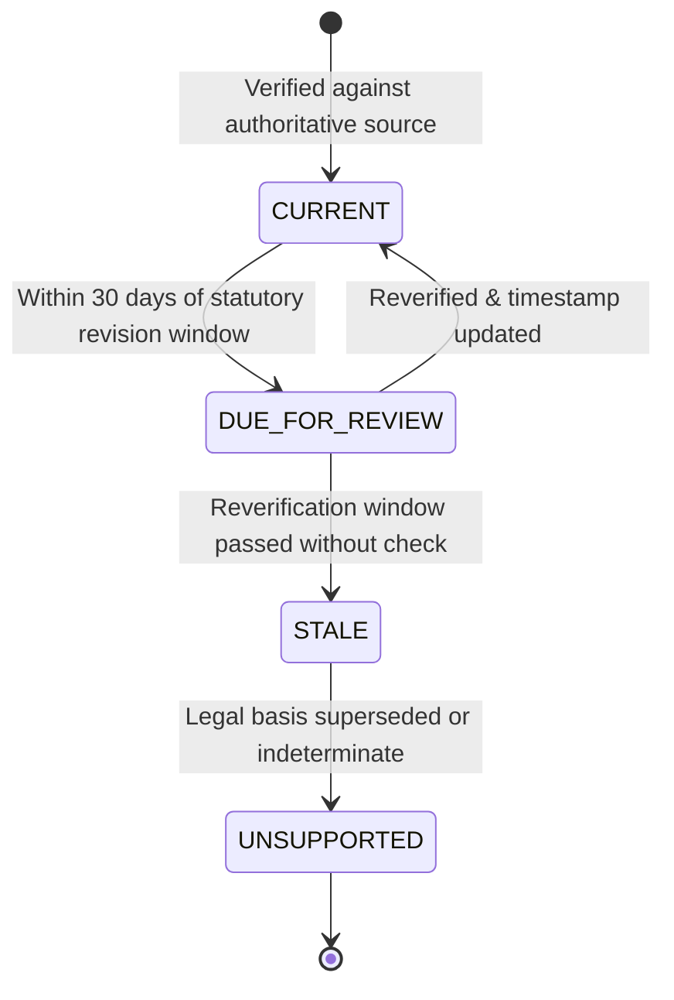

# Japan Life V1: Regulatory Maintenance & Update Policy

- **Effective Date**: 2026-09-11
- **Domain**: Japan Life Regulatory Subsystems
- **Policy Philosophy**: Scheduled Verification, Traceable Provenance, Zero Silent Staleness

---

## 1. Statutory Update Cadence by Regulatory Area

| Cadence Category | Regulatory Topics | Statutory Effective Date | Annual Reverification Window | Authoritative Source |
| :--- | :--- | :--- | :--- | :--- |
| **Annual Calendar-Year Tax** | Income Tax brackets, Basic Deduction, Employment Deduction, Spousal Deductions | January 1 (and Nenmatsu Chousei in December) | **November 1 — December 15** | National Tax Agency (国税庁) |
| **Fiscal-Year Insurance** | Health Insurance (Kyōkai Kenpō 47 branch rates), Welfare Pension, Care Insurance (Kaigo) | April 1 (Fiscal Year) | **March 1 — March 25** | Japan Health Insurance Association (協会けんぽ), JPS (日本年金機構) |
| **Mid-Year Employment Insurance** | Unemployment Basic Allowance minimum wage floor, age group daily wage caps | August 1 | **July 15 — July 31** | Ministry of Health, Labour and Welfare (厚生労働省) |
| **Periodic Statutory Reforms** | Immigration fees, photo rules, immigration law amendments | Specific statutory date (e.g. June 14, October 1) | **30 days prior to gazetted enactment** | Ministry of Justice / ISA (出入国在留管理庁) |
| **Municipal Subsidies & Baselines** | Child healthcare subsidy limits, local convenience store kiosk discounts | Ongoing municipal revisions | **Quarterly Spot Checks** (Jan, Apr, Jul, Oct) | Municipal Ward/City Hall official portals |
| **Administrative Forms** | Immigration application forms, municipal tax declaration slips | Ministerial updates | **Semi-Annual Review** | e-Gov Japan, NTA Form Registry |

---

## 2. Source Staleness & Verification Lifecycle

Every regulatory source and rule within Toolio transitions through explicit lifecycle states:

- **CURRENT**: Fully verified against primary official authority. Displayed with green provenance badge.
- **DUE_FOR_REVIEW**: Entering statutory revision period. System continues serving verified rates with scheduled check advisory.
- **STALE**: Rate exceeded statutory period without reverification. Tool displays clear disclosure: *"Dữ liệu cần cập nhật theo thông báo mới nhất của cơ quan quản lý"*. Never silently served as guaranteed current.
- **UNSUPPORTED**: Out-of-bounds historical or future dates. Tool gracefully falls back to national baseline with prominent notice.

---

## 3. Maintenance Protocol (Human-in-the-Loop Verification)

Toolio deliberately avoids brittle web-scraping for legal rates. Updates follow a deterministic 4-step engineering protocol:
1. **Official Gazette Audit**: Retrieve primary PDF/HTML from `e-Gov`, `moj.go.jp`, `nta.go.jp`, or `mhlw.go.jp`.
2. **Deterministic Table Update**: Modify statutory tables under `packages/core/src/japan/*/rules/`.
3. **Golden Boundary Test Execution**: Run boundary tests (threshold - 1, exact, threshold + 1) in `packages/core/tests/`.
4. **Metadata & Timestamp Stamping**: Update `lastVerifiedAt` in `packages/core/src/regulatory/sourceRegistry.js`.
